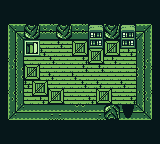

# Aether
A solo project written in GB Studio for the Gameboy Color. It's an RPG epic with an emphasis on story-telling.

# Plot
The story follows an ancient warrior, Aylmera, who is resurrected many years after her death.
With the current Kingdom in peril, she's called upon by the Crown to undertake a dangerous journey and restore order to the entire Realm.

Along the way, she encounters many friends and foes who shape her understanding of the Realm and its brutal past.
Plagued with the knowledge and consequences of what has been, she and her party must forge a path forward, in an attempt to save what remains of the Kingdom.

Fighting for a set of virtues that seem more and more out of touch with reality, she finds her mind, body, and soul are all put to the test.

# Screens
Some still screens that have been developed so far for the game:

